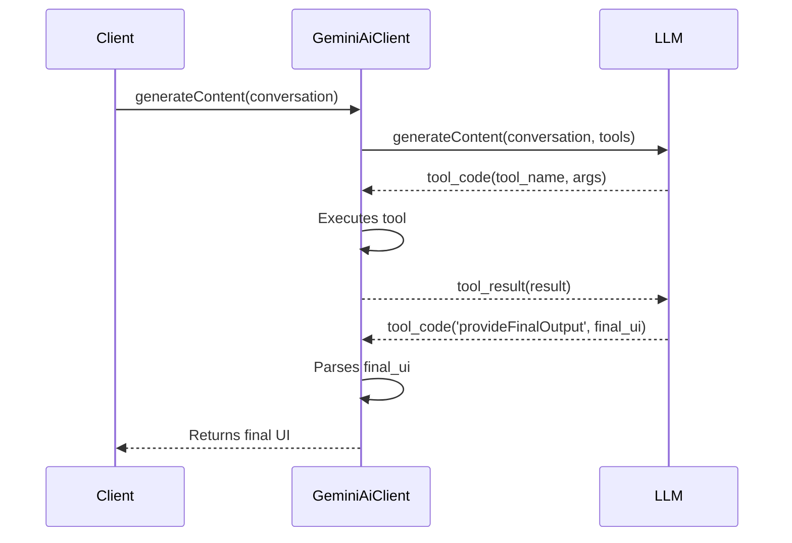
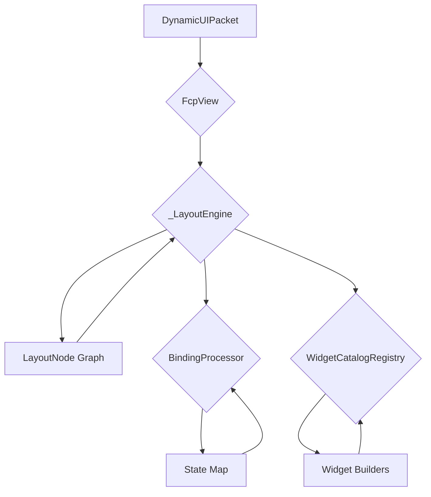
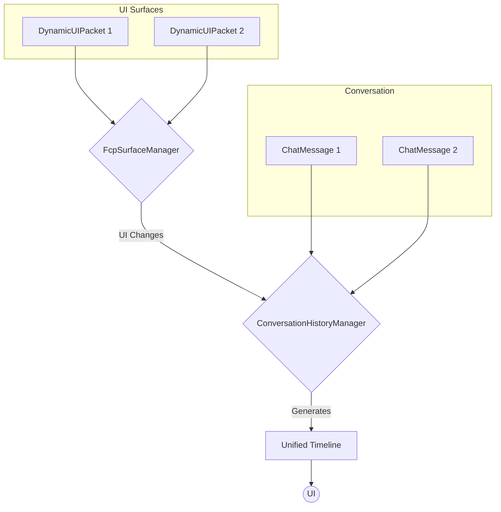
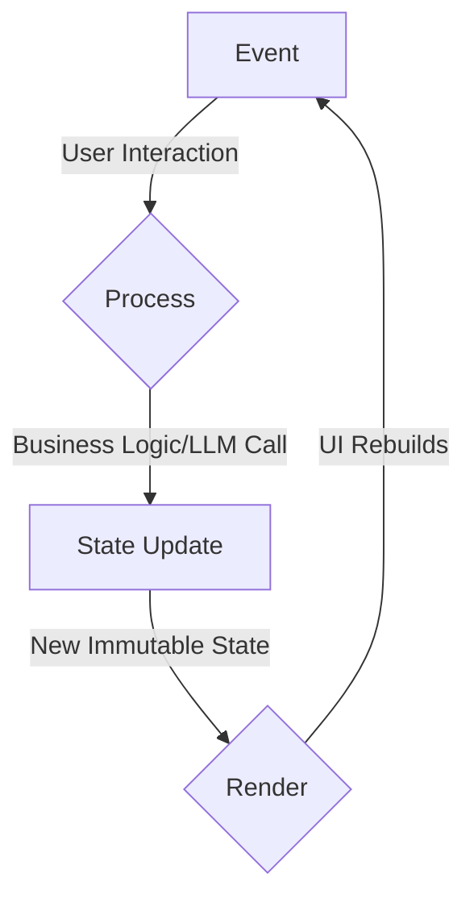
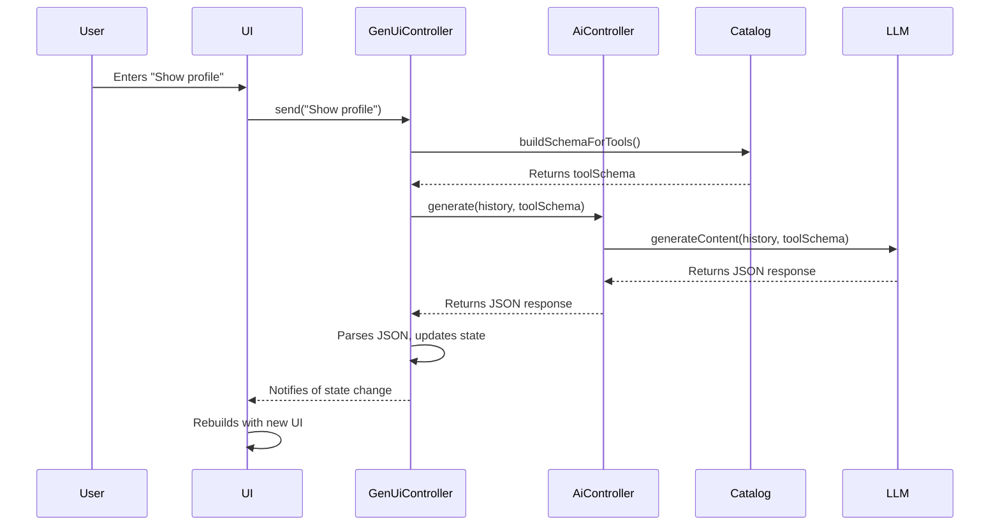
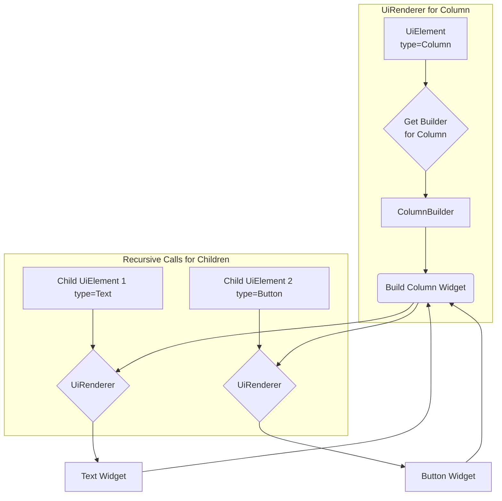

# A Proposal for a Modern, Idiomatic SDK for AI-Generated UIs in Flutter (Revised)

## I. Analysis of the Current FCP-Based SDK Architecture

An examination of the existing four-package SDK—comprising `ai_client`, `fcp_client`, `fcp_tools`, and `dart_schema_builder`—reveals a functional but architecturally complex system for generating user interfaces via Large Language Models (LLMs). The architecture exhibits a clear separation of concerns, with distinct packages for AI interaction, UI rendering, high-level tooling, and schema management. However, a deeper analysis uncovers several architectural decisions that create significant friction for developers, increase cognitive load, and deviate from modern, idiomatic Dart and Flutter practices. These points of friction are not superficial but are fundamental to the SDK's design, impacting its maintainability, extensibility, and ease of integration into the broader Flutter ecosystem.

### A. The AI Interaction Layer (`ai_client`)

The `ai_client` package forms the core of the interaction with the LLM. Its primary implementation, `GeminiAiClient`, orchestrates a sophisticated but opaque process to elicit structured UI data from the model. While effective in its goal, its design introduces patterns that are antithetical to the principles of clarity, predictability, and functional purity that characterize modern Dart development.

The central mechanism is a "forced tool calling" loop, encapsulated within the private `_generateContentForcedToolCalling` method. In this paradigm, the LLM is constrained to respond only by invoking predefined functions, or "tools," which are abstracted by the

`AiTool` class.[1, 1] This loop continues, exchanging tool calls and tool responses with the model, until a special internal tool, `provideFinalOutput`, is invoked. This final call signals that the AI has completed its task and its arguments contain the desired structured output.



A significant architectural anti-pattern resides in the public-facing `generateContent` method. Its signature, `Future<T?> generateContent<T extends Object>(List<ChatMessage> conversation,...)` , accepts a list of

`ChatMessage` objects representing the conversation history. Critically, this list is mutated in place during the method's execution; the entire multi-turn tool-calling dialogue is appended to the original list provided by the caller. This introduction of side effects violates a core tenet of modern, robust software design. Functions that modify their arguments are less predictable and harder to debug than pure functions that return a new, transformed value without altering the original inputs. This design choice forces developers to manage state that can be changed by a "black box" process, running counter to the explicit and predictable state flow encouraged by modern frameworks.

Furthermore, the entire iterative tool-calling process is an internal implementation detail, completely hidden from the developer who invokes `generateContent`. The developer initiates the call and awaits a final result, with no visibility or control over the intermediate steps. This opacity prevents the implementation of crucial application-level logic, such as custom handling for specific tool failures, structured logging of the AI's reasoning process (i.e., the sequence of tool calls), or the injection of business logic between tool executions. The developer is left with a monolithic, all-or-nothing operation, which limits the SDK's flexibility in more complex, real-world scenarios.

### B. The UI Protocol and Rendering Layer (`fcp_client`)

The `fcp_client` package is responsible for defining, rendering, and updating the AI-generated UI. It introduces the "Flutter Composition Protocol" (FCP), a declarative format for describing a user interface. The protocol's top-level structure is the `DynamicUIPacket`, which cleanly separates the UI's structure (`Layout`) from its data (`State`). The

`Layout` itself is a flat list of `LayoutNode` objects, an adjacency-list model that offers flexibility.

The core rendering component is the `FcpView` widget, a stateful widget that interprets the `DynamicUIPacket`. Its internal

`_LayoutEngine` traverses the `LayoutNode` graph, resolves data bindings against the `State` map via a `BindingProcessor` , and uses a

`WidgetCatalogRegistry` to map node types to concrete Flutter widget builders.



While this separation is architecturally sound in principle, its implementation creates two major points of friction. The first is a fundamental impedance mismatch between the FCP's internal state management model and the broader Flutter state management ecosystem. The `FcpView` maintains its own isolated state within an `FcpState` object, which leverages `ChangeNotifier` for updates. This creates a self-contained state "island" within the application. Modern Flutter applications, however, are typically built around established, powerful state management libraries such as Provider, Riverpod, or BLoC, which provide idiomatic and scalable patterns for managing application-wide state. A developer seeking to integrate an FCP-generated UI into an existing application is faced with a difficult choice: either manage two separate and incompatible state systems or build a complex, error-prone synchronization bridge between their chosen state management solution and the FCP's internal model. This creates a significant barrier to adoption and violates the design principle of meeting developer expectations.

The second major issue lies in the mechanism for UI updates. The `FcpViewController` allows for programmatic updates to the UI, but it does so by accepting `StateUpdate` and `LayoutUpdate` payloads. These payloads are lists of operations defined by the JSON Patch standard (RFC 6902), which are then applied by a

`StatePatcher` or `LayoutPatcher`.[1, 1] This approach is fundamentally imperative; it is a set of instructions on _how to mutate_ the current UI state to arrive at a new one. This stands in stark contrast to Flutter's declarative paradigm, which is built on the principle that "UI is a function of state". In idiomatic Flutter, developers describe the UI for a given state, and the framework efficiently computes the necessary changes when a new, immutable state is provided.

The JSON Patch mechanism is not only non-idiomatic but also fragile. The LLM, as the producer of these patches, must have perfect, up-to-the-minute knowledge of the client's current UI structure. If the client state has changed in a way the LLM is unaware of, a patch operation targeting a specific path or index can easily fail at runtime, as demonstrated by the SDK's own test suite.[1, 1] This reliance on string-based paths and indices lacks compile-time safety and reintroduces the very class of state-synchronization bugs that declarative frameworks were designed to eliminate.

### C. The Tooling and Orchestration Layer (`fcp_tools`)

The `fcp_tools` package provides the high-level components that bind the system together and expose its capabilities to the LLM. The `ManageUiTool` defines a suite of functions—`ui.set`, `ui.patchLayout`, `ui.patchState`, etc.—that serve as the AI's interface for manipulating the UI, directly mapping to the functionalities of the `fcp_client`.

The orchestration of multiple UI components and their integration into a conversational flow is handled by two key manager classes: `FcpSurfaceManager` and `ConversationHistoryManager`. The `FcpSurfaceManager` is responsible for the lifecycle of multiple, independent UI "surfaces," each with its own packet and controller. The

`ConversationHistoryManager` then listens for changes in the `FcpSurfaceManager` and interleaves these UI surfaces with `ChatMessage` objects to construct a unified, user-facing timeline. This is demonstrated in the example application, where the UI renders a list of

`ConversationEntry` objects, which can be either a message or a UI surface.



The very necessity of these complex manager classes points to an underlying flaw in the SDK's core data model. The system treats conversational text (`ChatMessage`) and user interfaces (`DynamicUIPacket`) as fundamentally separate and disconnected entities. The `ConversationHistoryManager` must then act as a reactive layer, composing these disparate types into a coherent view _after_ they have been created. This is a sign of a fragmented domain model. A more robust and simpler architecture would be built upon a single, unified state model that can represent the entire conversation—including both text and UI elements—from the outset. Such a design would align with the "single source of truth" principle, which is a cornerstone of modern, scalable application architecture , and would obviate the need for complex, reactive orchestration logic.

## II. Guiding Principles for a Modern GenUI API

To address the architectural shortcomings of the existing SDK, a redesign must be grounded in a set of clear, modern principles. These principles, derived from established software engineering best practices and tailored to the Dart and Flutter ecosystem, will guide every decision in the creation of a new, idiomatic, and developer-friendly API.

### A. Simplicity and Minimalism (KISS Principle)

The "Keep It Simple, Stupid" (KISS) principle is a design philosophy that posits systems work best when they are kept simple rather than made complex. The core idea is to avoid unnecessary complexity, as simplicity guarantees the greatest levels of user acceptance and interaction. For an SDK, the "user" is the developer, and their acceptance depends on an API that is easy to understand, use, and debug. Simple code is more maintainable, readable, and less prone to bugs.

In applying this principle, the new API will be designed to be "as simple as possible, but not simpler". It will prioritize clarity and focus on the essential features required to achieve the primary goal: building AI-generated UIs. This means providing a high-level API that abstracts away the intricate details of the LLM interaction loop for the majority of common use cases, thereby reducing the cognitive load on the developer. Every component, class, and method will have a clear, singular purpose, avoiding clever or convoluted solutions that might confuse future maintainers.

### B. Idiomatic Dart and Flutter Practices

An SDK should feel like a natural extension of its host platform. The proposed API will be deeply idiomatic, embracing the conventions and patterns that experienced Flutter developers already know and use. This involves leveraging modern Dart language features to create expressive and safe code. Naming conventions and API design will follow the guidelines of Effective Dart, preferring clarity over brevity and structuring code to read like a sentence.

Most importantly, the API will integrate seamlessly with the Flutter framework rather than competing with it. It will avoid creating bespoke, isolated systems for core functionalities like state management. Instead, it will expose its state through standard, framework-provided mechanisms such as `ValueListenable` or `Stream`. This crucial decision empowers developers to integrate the AI-generated UI into their applications using the state management libraries they are already proficient with, be it Provider, Riverpod, BLoC, or another solution. This approach fosters a sense of familiarity and trust, making the SDK a cooperative component within the broader Flutter ecosystem.

### C. JSON-Centric, Type-Safe, and Immutable Data Models

The foundation of a predictable and robust application is a well-defined and reliable state model. The new API will be built upon the principles of immutability and a JSON-centric data structure, enhanced with modern Dart features for type safety. Recognizing that LLMs most reliably produce structured data as JSON, the core data models will be represented by **Dart extension types**.

Extension types provide a zero-cost abstraction, allowing us to create new, distinct static types that wrap the raw `Map<String, Object?>` from the JSON parser. This gives us the best of both worlds: we retain the flexibility of a JSON-based protocol while gaining compile-time safety. A method signature like

`onEvent(ButtonClickEvent event)` is now possible, preventing developers from accidentally passing an incorrectly structured map.

When the state needs to change, the API will not mutate existing objects in place; instead, it will produce a new, updated state object. This approach, a cornerstone of state management patterns like Redux and BLoC , eliminates an entire category of bugs related to unexpected side effects. State changes become explicit, atomic, and easy to trace, directly supporting Flutter's declarative nature where the "UI is a function of (immutable) state".

### D. Layered and Extensible Architecture

Not all developers have the same needs. A successful API must cater to a spectrum of use cases, from simple prototyping to complex, production-grade applications. To achieve this, the new SDK will be designed with a layered architecture, providing distinct levels of abstraction.

The high-level API will be optimized for simplicity and speed of development. It will provide a small set of powerful, "batteries-included" components that handle the majority of the boilerplate and orchestration automatically. This layer is the "80% solution," designed for developers who want to get a functional AI-driven UI up and running with minimal effort.

Beneath this, a low-level API will offer granular control and maximum flexibility for power users. This layer will expose the core, unopinionated building blocks of the system—such as the AI interaction client and the UI rendering engine—as separate, composable components. This "20% solution" empowers developers to build their own custom interaction loops, integrate bespoke rendering logic, or use parts of the SDK in ways not envisioned by the high-level API. This layered approach ensures the SDK is both accessible to beginners and powerful enough for experts.

### E. Unidirectional Data Flow (UDF)

To ensure that state changes are predictable and easy to debug, the API's architecture will enforce a unidirectional data flow. This pattern dictates that data moves through the application in a single, consistent loop:

1. **Event:** The UI dispatches an event in response to user interaction (e.g., a button click).
2. **Process:** A central controller or business logic component receives the event and processes it. This may involve making a call to the LLM or executing client-side logic.
3. **State Update:** Based on the result of the processing, the controller produces a new, immutable state object.
4. **Render:** The new state flows back to the UI, which then rebuilds itself to reflect the changes.



This clear, one-way flow prevents the chaotic, hard-to-trace state mutations that can occur when UI components are allowed to modify state directly. It makes the application's behavior easier to reason about and is the foundational pattern for many of the most successful state management solutions in the declarative UI world.

## III. The Proposed `GenUI` SDK: A Layered, Idiomatic API

Based on the guiding principles, this section proposes a new, unified SDK named `gen_ui`. This SDK is designed from the ground up to be simple, powerful, and a first-class citizen in the Flutter ecosystem. It replaces the fragmented four-package system with a single, cohesive, and layered API that is built around the practical reality of JSON-based LLM communication and developer extensibility.

### A. The JSON-Centric UI Model with Extension Types

The cornerstone of the new architecture is a unified, immutable tree of `UiElement` objects. This model is designed to be directly deserialized from the JSON output of an LLM. To add a layer of static type safety without runtime cost, we define `UiElement` as a Dart **extension type** that wraps the underlying `Map<String, Object?>`.

```dart
// A zero-cost, type-safe wrapper around the raw JSON map for a UI element.
extension type UiElement(Map<String, Object?> _json) {
  // Provide convenient, strongly-typed accessors to the underlying data.
  String get id => _json['id'] as String;
  String get type => _json['type'] as String;
  Map<String, Object?> get properties =>
      _json['properties'] as Map<String, Object?>??? const {};
  List<UiElement> get children =>
      (properties['children'] as List<Object?>???)
         .map((childJson) => UiElement(childJson as Map<String, Object?>))
         .toList();
}
```

This model is fundamentally superior to a plain map. A function signature can now demand a `UiElement`, and the compiler will ensure that only an object created as a `UiElement` can be passed, preventing a common class of runtime errors. The LLM's task remains the same: generate a JSON tree where each object has an `id` and a `type` that corresponds to a known widget.

**Example JSON from LLM:**

```json
{
  "id": "profile_card",
  "type": "Column",
  "properties": {
    "children":
  }
}
```

### B. The Extensible `WidgetCatalog`

A core requirement is that developers can easily mix and match provided widgets with their own custom components. The `WidgetCatalog` is designed explicitly for this purpose. It serves as a registry that maps `type` strings from the `UiElement` JSON to concrete Flutter widget builders and JSON deserializers.

```dart
// A function that builds a Flutter Widget from a UiElement.
typedef GenUiWidgetBuilder = Widget Function(
  BuildContext context,
  UiElement element,
  // Children are pre-built and passed in for convenience.
  Map<String, List<Widget>> children,
);

// A function that creates a JSON Schema for a widget's properties.
typedef SchemaFactory = dsb.Schema Function();

// Holds the information needed to render and define a widget.
class WidgetRegistration {
  const WidgetRegistration({
    required this.builder,
    required this.schemaFactory,
  });

  final GenUiWidgetBuilder builder;
  final SchemaFactory schemaFactory;
}

// The central registry for all available widgets.
class WidgetCatalog {
  final Map<String, WidgetRegistration> _widgets = {};

  // Register a new widget type.
  void register(String type, WidgetRegistration registration) {
    _widgets[type] = registration;
  }

  // Get the builder for a given type.
  GenUiWidgetBuilder? getBuilder(String type) => _widgets[type]?.builder;

  // Build the complete JSON schema for all tools, to be sent to the LLM.
  dsb.Schema buildSchemaForTools() {
    // Logic to combine all individual widget schemas from schemaFactory
    // into a single, large schema that the LLM can use for validation.
    final definitions = <dsb.Schema>;
    for (final entry in _widgets.entries) {
      definitions.add(dsb.Schema.object(
        properties: {
          'type': dsb.Schema.string(constValue: entry.key),
          'properties': entry.value.schemaFactory(),
        },
      ));
    }
    return dsb.Schema.combined(oneOf: definitions);
  }
}
```

**Developer Usage Example:** This pattern is both simple and powerful. The developer instantiates a catalog, registers the provided default widgets, and then registers their own custom widgets.

```dart
// 1. Create a catalog instance.
final catalog = WidgetCatalog();

// 2. (Optional) Register default widgets provided by the gen_ui package.
catalog.register('Column', columnRegistration);
catalog.register('Text', textRegistration);

// 3. Register a custom widget.
catalog.register('UserProfileCard', WidgetRegistration(
  builder: (context, element, children) {
    // Use the type-safe accessors from the extension type.
    final properties = element.properties;
    return MyUserProfileCard(
      userName: properties['userName'] as String,
      avatarUrl: properties['avatarUrl'] as String,
    );
  },
  schemaFactory: () => dsb.Schema.object(
    properties: {
      'userName': dsb.Schema.string(description: "The user's full name."),
      'avatarUrl': dsb.Schema.string(description: "URL for the user's avatar image."),
    },
    required: ['userName'],
  ),
));
```

### C. The High-Level API: `GenUiController` and `GenUi` Widget

The high-level API remains conceptually the same, providing a simple entry point for most developers. However, its internal implementation is updated to align with the new JSON-centric and extensible model.

#### `GenUiController`

The controller now orchestrates the JSON-based interaction.

```dart
class GenUiController {
  GenUiController({required this.aiController, required this.widgetCatalog});

  final AiController aiController;
  final WidgetCatalog widgetCatalog;

  ValueListenable<GenUiState> get state => _stateNotifier;
  final ValueNotifier<GenUiState> _stateNotifier = ValueNotifier(GenUiState.initial());

  Future<void> send(String text) async {
    // 1. Add user message to state.
    // 2. Create the full schema from the widget catalog.
    final toolSchema = widgetCatalog.buildSchemaForTools();
    // 3. Call the AI, asking it to respond by calling a tool (e.g., `displayUi`)
    //    whose parameters are defined by our generated schema.
    final responseJson = await aiController.generate(
      history: state.value.history,
      toolSchema: toolSchema,
    );

    // 4. Parse the JSON response.
    if (responseJson!= null) {
      // The controller is responsible for parsing the response and updating
      // the state with the new UiElement tree or text message.
      final newTurn = ConversationTurn.fromJson(responseJson);
      //... update state...
    }
  }

  void onEvent(UiEvent event) {
    //... logic to handle UI events...
  }
  //... dispose, etc.
}
```



#### `UiRenderer` Widget

The rendering logic is now driven by the `WidgetCatalog`. The `UiRenderer` is a low-level widget that takes a `UiElement` and the `catalog` and is responsible for recursively building the UI.

```dart
class UiRenderer extends StatelessWidget {
  const UiRenderer({
    super.key,
    required this.element,
    required this.catalog,
    required this.onEvent,
  });

  final UiElement element;
  final WidgetCatalog catalog;
  final ValueChanged<UiEvent> onEvent;

  @override
  Widget build(BuildContext context) {
    // 1. Look up the builder function for the element's type.
    final builder = catalog.getBuilder(element.type);

    if (builder == null) {
      return ErrorWidget("Widget type '${element.type}' not found in catalog.");
    }

    // 2. Recursively build children.
    final builtChildren = <String, List<Widget>>{};
    // (This logic would be more complex, handling properties that are children)
    for (final childElement in element.children) {
       //... logic to find which property this child belongs to...
       // and then build it recursively:
       // UiRenderer(element: childElement,...);
    }

    // 3. Call the builder to construct the widget.
    return builder(context, element, builtChildren);
  }
}
```



## IV. API Specification and Practical Application

This section provides concrete examples of how the revised `GenUI` SDK would be used, demonstrating its practicality and extensibility.

### A. Use Case 1: Generating a Fixed UI Surface

**Scenario:** An application needs to generate a static login form based on a user prompt.

**Implementation:** The developer's interaction with the high-level API is almost identical to the previous proposal, but the underlying mechanism is now more robust.

```dart
// 1. Define the catalog with standard and custom widgets.
final catalog = WidgetCatalog()
..register('Column', columnRegistration)
..register('TextField', textFieldRegistration)
..register('ElevatedButton', elevatedButtonRegistration);

// 2. Initialize the controller with the catalog.
final genUiController = GenUiController(
  aiController: MyAiController(),
  widgetCatalog: catalog,
);

// 3. Send the prompt. The controller handles schema generation and JSON parsing.
void generateLoginForm() {
  genUiController.send('Generate a login form.');
}

// 4. The GenUi widget uses a UiRenderer internally, passing the catalog to it.
@override
Widget build(BuildContext context) {
  return GenUi(
    controller: genUiController,
    // The uiBuilder would contain a UiRenderer instance.
    uiBuilder: (context, rootElement) => UiRenderer(
      element: rootElement,
      catalog: catalog,
      onEvent: genUiController.onEvent,
    ),
    //... messageBuilder
  );
}
```

### B. Use Case 2: Building a Chat App with a Custom Widget

**Scenario:** A social media app wants to generate a user profile card inline in a chat conversation. The `UserProfileCard` is a custom widget defined by the app developer.

**Implementation:**

1. **Define the Custom Widget:**

   ```dart
   class UserProfileCard extends StatelessWidget {
     //... constructor and build method
   }
   ```

2. **Register the Custom Widget:** The developer registers their custom widget with the `WidgetCatalog` at application startup.

   ```dart
   final catalog = WidgetCatalog()
   ..register('Text', textRegistration) // Registering a default widget
   ..register('UserProfileCard', WidgetRegistration( // Registering the custom one
       builder: (context, element, children) {
         final properties = element.properties;
         return UserProfileCard(
           userName: properties['userName'] as String,
           followerCount: properties['followerCount'] as int,
         );
       },
       schemaFactory: () => dsb.Schema.object(
         properties: {
           'userName': dsb.Schema.string(),
           'followerCount': dsb.Schema.integer(),
         },
         required: ['userName', 'followerCount'],
       ),
     ));
   ```

3. **Prompt the LLM:** The user (or system) sends a prompt.

   ```dart
   controller.send("Show me the profile for @jane_doe.");
   ```

4. **LLM Response:** The `GenUiController` sends the combined schema (including the schema for `UserProfileCard`) to the LLM. The LLM, now aware of this custom component, can generate the appropriate JSON.

   ```json
   {
     "type": "ui",
     "element": {
       "id": "jane_doe_card",
       "type": "UserProfileCard",
       "properties": {
         "userName": "Jane Doe",
         "followerCount": 1250
       }
     }
   }
   ```

5. **Rendering:** The `GenUiController` parses this JSON into a `UiElement` tree. The `UiRenderer` finds `'UserProfileCard'` in the `WidgetCatalog`, invokes the custom builder function provided by the developer, and the `UserProfileCard` widget appears on the screen.

## V. Architectural Justification and Migration Path

This revised proposal is a deliberate move towards an architecture that is more robust, practical for LLM-based generation, and idiomatic to the real-world needs of Flutter developers.

### A. Architectural Comparison Table

| Feature              | Previous Proposal                                                                          | Revised `GenUI` SDK                                                                                     | Rationale for Change                                                                                                                   |
| -------------------- | ------------------------------------------------------------------------------------------ | ------------------------------------------------------------------------------------------------------- | -------------------------------------------------------------------------------------------------------------------------------------- |
| **UI Definition**    | Immutable tree of `UiElement` classes, deserialized from JSON.                             | Immutable tree of `UiElement` **extension types** wrapping a JSON map.                                  | Adds a layer of static type safety at zero runtime cost. Prevents passing arbitrarily structured maps where a `UiElement` is expected. |
| **Type System**      | Base classes with a `type` string property and `fromJson` factories.                       | Extension types with getters for `type`, `id`, etc., providing a type-safe API over the underlying map. | Improves developer ergonomics and leverages modern Dart features for safer code.                                                       |
| **Widget Catalog**   | An explicit `WidgetCatalog` class where developers `register` widget builders and schemas. | An explicit `WidgetCatalog` class where developers `register` widget builders and schemas.              | **(No Change)** This remains a core principle for extensibility.                                                                       |
| **AI Interaction**   | Requests and parses a JSON object, which is then mapped to a `ConversationTurn`.           | Requests and parses a JSON object, which is then mapped to a `ConversationTurn`.                        | **(No Change)** This accurately models the interaction with a real LLM.                                                                |
| **State Management** | Exposes state via `ValueListenable`.                                                       | Exposes state via `ValueListenable`.                                                                    | **(No Change)** This remains a core principle, ensuring seamless integration with the Flutter state management ecosystem.              |

### B. Migration and Coexistence Strategy

The proposed architecture, while a significant improvement, can be adopted incrementally. An adapter layer can be created to convert the new `UiElement` tree into the older FCP `DynamicUIPacket` format.

```dart
// Adapter function to bridge the new and old models.
DynamicUIPacket convertUiElementToFcpPacket(UiElement rootElement) {
  //... conversion logic...
}
```

This allows teams to first adopt the new, improved `AiController` and JSON-based interaction model. The JSON response can be parsed into a `UiElement` tree and then converted via the adapter to the FCP format for rendering with the existing `FcpView`. This provides immediate benefits in the AI interaction layer while allowing the rendering layer to be migrated over time.

## VI. Conclusion

The original proposal laid a strong foundation based on modern architectural principles. This revision builds upon that foundation by incorporating crucial, practical feedback regarding the realities of LLM interaction, the necessity of developer-driven extensibility, and the benefits of modern Dart language features.

By embracing a JSON-centric data model wrapped in type-safe, zero-cost **extension types**, and by providing a first-class API for an extensible `WidgetCatalog`, the revised `GenUI` SDK is no longer just a theoretically sound design, but a pragmatic and powerful tool. It offers developers a simple on-ramp for basic use cases while providing the flexibility and control needed to integrate complex, custom UI components into an AI-driven workflow. This approach results in a system that is more robust, easier to extend, and better aligned with both the capabilities of large language models and the needs of the Flutter development community.
