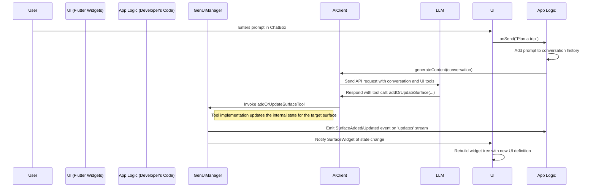
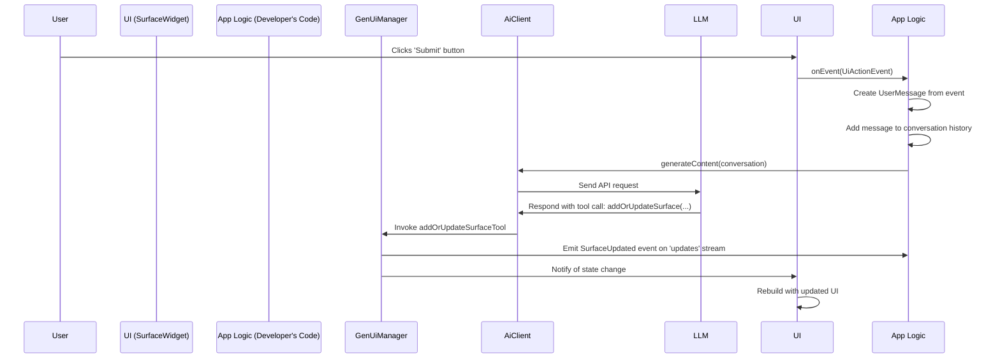

# Migration Plan: From Direct UI Generation to Tool-Based UI Management

## 1. Introduction & Motivation

Currently, the `flutter_genui` package uses a direct-response architecture where the `GenUiManager` calls an `AiClient`, expecting the Large Language Model (LLM) to return a single JSON object describing UI manipulations.

This proposal outlines a migration to a more flexible and powerful tool-based architecture. Instead of the LLM returning a UI description, it will call tools that directly manipulate the UI. This decouples UI state management from AI interaction, giving developers full control over the generative process.

### Benefits of the New Architecture

- **Developer Control & Extensibility**: Developers are responsible for configuring their own `AiClient` and managing the conversation flow. This allows them to register custom tools alongside the standard UI generation tools, creating powerful, integrated AI experiences.
- **Clear Separation of Concerns**: The `AiClient` is solely responsible for LLM interaction and tool dispatch. The `GenUiManager` becomes a pure UI state management container, with no knowledge of the `AiClient`.
- **Improved LLM Instruction**: The schemas for the UI generation tools are highly descriptive, acting as a clear and robust set of instructions for the LLM, leading to more reliable UI generation.

## 2. High-Level Design

The new architecture is composed of three core, decoupled components.

### Core Components

1. **`AiClient` (User-Managed)**: The developer instantiates and configures the `AiClient` (e.g., `GeminiAiClient`). They are responsible for managing the conversation history, crafting system prompts, and calling `generateContent`.
2. **`GenUiManager` (State & Tool Provider)**: This class is the central hub for UI state management. Its responsibilities are strictly limited to:
   - Managing the state (`UiDefinition`) of all active UI "surfaces".
   - Providing the `AiTool` implementations that the LLM will call. These tools delegate the actual state manipulation back to the manager.
   - Notifying observers of changes to the UI surfaces via a stream.
3. **UI Generation Tools**: A set of `AiTool`s provided by the `GenUiManager` that form the API for the LLM to manipulate the UI. The developer registers these tools with their `AiClient`. The available tools are:
   - **`addOrUpdateSurface`**:
     - **Description**: "Adds a new UI surface or updates an existing one. Use this to display new content or change what is currently visible."
     - **Parameters**:
       - `surfaceId` (string, required): The unique identifier for the UI surface to create or modify.
       - `definition` (object, required): The UI definition object that describes the widgets to be rendered. The schema for this parameter is dynamically generated based on the `Catalog` provided to the `GenUiManager`.
   - **`deleteSurface`**:
     - **Description**: "Removes a UI surface that is no longer needed."
     - **Parameters**:
       - `surfaceId` (string, required): The unique identifier for the UI surface to remove.

### Observing UI Changes

To allow the developer's application logic to react to UI changes initiated by the LLM, the `GenUiManager` will expose a stream of UI update events.

- **`genUiManager.updates`**: A `Stream<GenUiUpdate>` that emits an event whenever a surface is added, updated, or removed.
- **`GenUiUpdate`**: A sealed class with the following subtypes:
  - `SurfaceAdded(String surfaceId)`: Fired when a new surface is created.
  - `SurfaceUpdated(String surfaceId, UiDefinition definition)`: Fired when an existing surface is modified.
  - `SurfaceRemoved(String surfaceId)`: Fired when a surface is deleted.

This allows developers to, for example, update their list of active surfaces or scroll a new surface into view when it is added.

### Data Flow: From User Prompt to UI

The following diagram illustrates the flow when a user submits a text prompt.



### Data Flow: From UI Event to UI Update

The following diagram illustrates the flow when a user interacts with a GenUI-rendered widget.



## 3. Detailed Migration Steps

### Phase 1: Core `flutter_genui` Package Refactoring

1. **Modify `AiClient` Interface**:

   - A new `generateText` function will be added to AiClient that will generate text without requiring a schema.
     - `Future<String> generateText(List<ChatMessage> conversation, {Iterable<AiTool> additionalTools = const []})`
       - This one will take optional tools, but return a `String`. Internally, it will stop using forced function calling.
   - The existing `generateContent` function will remain.

2. **Implement UI Generation Tools**:

   - A new file, `lib/src/ui_tools.dart`, will contain the definitions for `AddOrUpdateSurfaceTool` and `DeleteSurfaceTool`.
   - These tools will accept a `GenUiManager` instance in their constructor to delegate UI state manipulation.

3. **Refactor `GenUiManager`**:

   - The new `GenUiManager` class will be a pure UI state manager.
   - It will maintain a `Map<String, ValueNotifier<UiDefinition?>>` to hold the state for all managed surfaces.
   - It will expose a `getTools()` method that returns instances of the UI Generation Tools.
   - It will expose a `Stream<GenUiUpdate> get updates` to notify developers of changes.
   - It will provide public methods like `addOrUpdateSurface(surfaceId, definition)` and `deleteSurface(surfaceId)` for the tools to call.

4. **Update `SurfaceWidget`**:

   - The `SurfaceWidget` will be refactored to take a `GenUiManager` instance, a `surfaceId`, and a new `onEvent` callback.
   - `typedef UiEventCallback = void Function(UiEvent event);`
   - It will listen to the appropriate `ValueNotifier` in the `GenUiManager` for its `surfaceId` and rebuild whenever the `UiDefinition` for that surface changes.
   - When a widget in the catalog dispatches an event, the `SurfaceWidget` will forward it to the `onEvent` callback.

5. **UI Event Handling**:
   - The concept of `UiActionEvent` and `UiChangeEvent` will be preserved.
   - The developer-provided `onEvent` callback on the `SurfaceWidget` will be invoked for all events.
   - It is the developer's responsibility to filter for `UiActionEvent`s (or other events of interest) to trigger an LLM inference.

### Phase 2 & 3: Example and Test Migration

- **Examples (`minimal_genui`, `travel_app`)**: The `main.dart` files will be updated to reflect the new decoupled architecture, showing the developer's responsibility for managing the `AiClient`, conversation state, and UI event handling.
- **Tests**: The `FakeAiClient` will be updated to better simulate tool-calling. All tests will be refactored to reflect the new separation of concerns.

## 4. New API Usage Example

This example demonstrates the developer's role in orchestrating the conversation and handling UI events.

```dart
// 1. Create the GenUiManager to manage UI state.
final genUiManager = GenUiManager(catalog: travelAppCatalog);

// 2. Create the AiClient, providing it with the UI tools from the manager.
final aiClient = GeminiAiClient(
  systemInstruction: "You are a helpful travel assistant...",
  tools: genUiManager.getTools(),
);

// 3. The developer is responsible for managing the conversation and calling the AiClient.
class MyHomePage extends StatefulWidget {
  const MyHomePage({super.key});
  @override
  State<MyHomePage> createState() => _MyHomePageState();
}

class _MyHomePageState extends State<MyHomePage> {
  final List<ChatMessage> _conversation = [];
  final List<String> _surfaceIds = ['main_surface']; // Start with one surface

  @override
  void initState() {
    super.initState();
    // 4. Listen for UI updates from the manager
    genUiManager.updates.listen((update) {
      setState(() {
        switch (update) {
          case SurfaceAdded(:final surfaceId):
            if (!_surfaceIds.contains(surfaceId)) {
              _surfaceIds.add(surfaceId);
            }
          case SurfaceRemoved(:final surfaceId):
            _surfaceIds.remove(surfaceId);
          case SurfaceUpdated():
        }
      });
    });
  }

  Future<void> _triggerInference() async {
    await aiClient.generateText(_conversation);
  }

  void _handleUiEvent(UiEvent event) {
    if (!event.isAction) return; // Only act on submit events

    setState(() {
      _conversation.add(
        UserMessage.text(
          'The user triggered the "${event.eventType}" event on widget '
          '"${event.widgetId}" with the value: ${event.value}.',
        ),
      );
    });
    _triggerInference();
  }


  void _sendPrompt(String text) {
    setState(() {
      _conversation.add(UserMessage.text(text));
    });
    _triggerInference();
  }

  @override
  Widget build(BuildContext context) {
    return Scaffold(
      appBar: AppBar(title: const Text('Travel Planner')),
      // 5. Build the list of surfaces (layout could be more complex)
      body: ListView.builder(
        itemCount: _surfaceIds.length,
        itemBuilder: (context, index) {
          final surfaceId = _surfaceIds[index];
          return SurfaceWidget(
            manager: genUiManager,
            surfaceId: surfaceId,
            onEvent: _handleUiEvent, // Provide the event handler
            defaultBuilder: (context) => const Center(
              child: Text("Ask me to plan a trip!"),
            ),
          );
        },
      ),
      bottomNavigationBar: ChatBox(
        onSend: _sendPrompt,
      ),
    );
  }
}
```

## 5. Prompt Migration Guide

The strategy for prompting the LLM will change significantly.

- **Old Prompt Strategy**: Detailed instructions on the exact structure of the JSON output.

  > "...You will respond by generating appropriate UI elements... You communicate via a single JSON object with a list of actions..."

- **New Prompt Strategy**: High-level instructions telling the model to act as an assistant and use the provided tools to accomplish its goals. The primary source of instruction for the LLM now comes from the names and descriptions of the tools and their parameters.
  > "You are a helpful assistant. Use the provided tools to build and manage the user interface in response to the user's requests. Call the `addOrUpdateSurface` tool to show new content or update existing content. Use the `deleteSurface` tool to remove UI that is no longer relevant."

The quality of the descriptions for the tools and their schemas will be critical for success.
