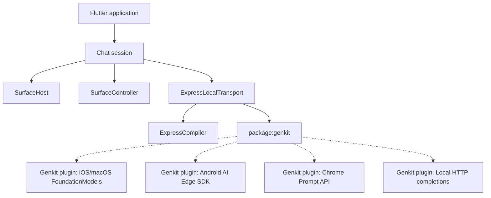

# Design specification: local generative UI with A2UI Express and Genkit

This document outlines the design for the `genui_express` Flutter package. The package integrates the A2UI Express compiler with the official Google Genkit Dart framework (`package:genkit`) and platform-specific on-device LLM engines to enable local Generative UI (GenUI) experiences.

## Architecture overview

The `genui_express` package serves as the coordinator between:
1. The **A2UI Express compiler**: translates simplified, human-writable layout DSL structures generated by Genkit models into standard A2UI JSON specifications.
2. The **Express prompt builder**: dynamically inspects component catalogs and generates compact A2UI Express grammar contracts to instruct local LLM engines.
3. The **Genkit model plugins**: registers native hardware-accelerated on-device models (Apple FoundationModels, Android AI Edge SDK, and Chrome Prompt API) as standard Genkit `Model` resources.
4. The **GenUI core transport system**: exposes standard Dart stream interfaces (`Transport`) that integrate with a `SurfaceController` to render interactive UI surfaces.

The following component diagram illustrates this flow:



## Interface contracts

Following the Contract-First Design principles, the package defines decoupled, intent-revealing interfaces for the compiler, prompt builder, native Genkit model plugins, and transport coordinator.

### Express compiler interface

The compiler class encapsulates parsing and validation logic to build standard A2UI envelopes.

```dart
/// A high-performance compiler that converts A2UI Express scripts into
/// valid A2UI envelopes.
class ExpressCompiler {
  /// Creates an [ExpressCompiler] instance configured with [catalog].
  ExpressCompiler(Catalog catalog);

  /// Compiles A2UI Express script [dslText] into a flat JSON-compatible
  /// envelope structure.
  Map<String, dynamic> compile(
    String dslText, {
    String surfaceId = 'default_surface',
    String catalogId = '',
  });
}
```

### Express prompt builder interface

To guide the LLM in generating appropriate layout trees, we define a dedicated `ExpressPromptBuilder` that extends and conforms to GenUI's core `PromptBuilder` interface. This allows developers to use it interchangeably in any existing GenUI initialization loops.

Traditional A2UI prompt builders write large JSON schemas to system prompts. Because local, on-device models (like Gemini Nano or Apple Intelligence) operate under smaller context windows and strict performance budgets, `ExpressPromptBuilder` converts catalog properties into compact, single-line positional signatures. This decreases token usage and improves inference speed.

```dart
import 'package:genui/genui.dart';

/// A prompt builder for A2UI Express that instructs the AI on outputting
/// layout trees in compact Express DSL syntax.
abstract class ExpressPromptBuilder implements PromptBuilder {
  /// Creates an [ExpressPromptBuilder] configured for a typical chat session.
  factory ExpressPromptBuilder.chat({
    required Catalog catalog,
    Iterable<String> systemPromptFragments = const [],
    String importancePrefix = PromptBuilder.defaultImportancePrefix,
    Map<String, dynamic>? clientDataModel,
  });

  /// Creates an [ExpressPromptBuilder] with full control over operations,
  /// capabilities, and custom fragments.
  factory ExpressPromptBuilder.custom({
    required Catalog catalog,
    required SurfaceOperations allowedOperations,
    Iterable<String> systemPromptFragments = const [],
    String importancePrefix = PromptBuilder.defaultImportancePrefix,
    TechnicalPossibilities technicalPossibilities = const TechnicalPossibilities(),
    Map<String, dynamic>? clientDataModel,
  });
}
```

*   **Positional Contract Generation**: The prompt builder dynamically introspects the `Catalog` and maps the properties in schema order. It lists required parameters and optional parameters (denoted with a `?` suffix) to generate compact documentation block signatures:
    *   *Component Signature*: `• TextField(label, value, placeholder?, type?, checks?)`
    *   *Function Signature*: `• required(value)`
*   **Grammar Guidelines**: The generated prompt contract directs the model to output layouts inside the `<a2ui>` and `</a2ui>` sentinel tags, following clear single-variable assignments per line, with a single root element designated by the `root` variable.

### Genkit custom model registration

Instead of defining custom ad-hoc interfaces, we register each native platform model as a standard Genkit model using `defineModel` from `package:genkit/plugin.dart`.

```dart
import 'package:genkit/genkit.dart';

/// Model reference for the on-device Apple FoundationModels engine.
final foundationModelRef = ModelReference(
  name: 'local/apple-foundation-models',
);

/// Model reference for the Android AI Edge SDK Gemini Nano engine.
final aiEdgeSdkModelRef = ModelReference(
  name: 'local/android-ai-edge',
);

/// Model reference for the developer HTTP completion engine.
final fallbackModelRef = ModelReference(
  name: 'local/http-completion',
);
```

### Local transport interface

The transport implementation coordinates the Genkit generation request and compiler execution, conforming directly to GenUI's `Transport` contract so it can be plugged into standard `SurfaceController` pipelines.

```dart
/// A [Transport] implementation that coordinates local Genkit LLM inference
/// and compiles the output using A2UI Express.
class ExpressLocalTransport implements Transport {
  /// The core Genkit engine instance.
  final Genkit ai;

  /// The target Genkit model to invoke.
  final ModelReference model;

  /// The A2UI Express compiler instance.
  final ExpressCompiler compiler;

  /// The component catalog used for compilation maps.
  final Catalog catalog;

  ExpressLocalTransport({
    required this.ai,
    required this.model,
    required this.catalog,
  }) : compiler = ExpressCompiler(catalog);

  @override
  Stream<String> get incomingText => ...;

  @override
  Stream<A2uiMessage> get incomingMessages => ...;

  @override
  Future<void> sendRequest(ChatMessage message) async { ... }

  @override
  void dispose() { ... }
}
```

## Platform-specific on-device Genkit plugins

Each native platform engine is wrapped in a custom Genkit plugin that executes local inference via platform channels.

### iOS and macOS: FoundationModels plugin

For Apple platforms (iOS 18+ and macOS 15+), the plugin registers a custom Genkit model that communicates with the native Swift `NaturalLanguage.LanguageModelSession` (Apple Intelligence) using `MethodChannel` and `EventChannel`.

*   **Swift API**:
    ```swift
    import NaturalLanguage

    func checkAvailability() -> Bool {
        return LanguageModelSession.hasCapability(.textGeneration)
    }

    func generateStream(prompt: String, systemPrompt: String?, completion: @escaping (String) -> Void) async throws {
        var config = LanguageModelSession.Configuration()
        if let system = systemPrompt {
            config.systemPrompt = system
        }
        let session = try await LanguageModelSession.create(configuration: config)
        let stream = try await session.generateResponse(for: prompt)
        for try await chunk in stream {
            completion(chunk)
        }
    }
    ```
*   **Dart Genkit model registration**:
    ```dart
    import 'package:genkit/genkit.dart';
    import 'package:genkit/plugin.dart';

    final foundationModelsPlugin = definePlugin(
      'foundationModels',
      (ai) {
        ai.defineModel(
          name: 'local/apple-foundation-models',
          fn: (request, streamController) async {
            // Exposes a streaming generator that feeds native EventChannel chunks
            // back to Genkit.
          },
        );
      },
    );
    ```

### Android: Google Play Services AI Edge SDK plugin

For Android, the plugin wraps `AICore` (Gemini Nano) via the Play Services AI Edge client libraries, exposing it as a standard Genkit model.

*   **Kotlin API**:
    ```kotlin
    import com.google.android.gms.ai.AiFeatureManager
    import com.google.android.gms.ai.generativeai.GenerativeModel

    fun checkAvailability(context: Context): Boolean {
        val manager = AiFeatureManager.create(context)
        return manager.isFeatureAvailable(AiFeatureManager.FEATURE_GEMINI_NANO)
    }

    suspend fun generateStream(prompt: String, systemPrompt: String?, onChunk: (String) -> Void) {
        val builder = GenerativeModel.Builder()
            .setModelName("gemini-nano")
        systemPrompt?.let { builder.setSystemInstruction(it) }
        val model = builder.build()
        model.generateContentStream(prompt).collect { chunk ->
            onChunk(chunk.text ?: "")
        }
    }
    ```
*   **Dart Genkit model registration**:
    ```dart
    import 'package:genkit/genkit.dart';
    import 'package:genkit/plugin.dart';

    final aiEdgePlugin = definePlugin(
      'aiEdge',
      (ai) {
        ai.defineModel(
          name: 'local/android-ai-edge',
          fn: (request, streamController) async {
            // Subscribes to a native EventChannel capturing Gemini Nano's
            // generateContentStream response chunks.
          },
        );
      },
    );
    ```

### Chrome: Prompt API plugin

For Chrome Web, we can utilize `package:genkit_chrome` directly or integrate a custom Genkit model mapping to `window.ai.languageModel`.

*   **JavaScript API**:
    ```javascript
    async function checkAvailability() {
        if (!window.ai || !window.ai.languageModel) return false;
        const caps = await window.ai.languageModel.capabilities();
        return caps.available !== 'no';
    }

    async function generateStream(prompt, systemPrompt, onChunk) {
        const session = await window.ai.languageModel.create({
            systemPrompt: systemPrompt
        });
        const stream = session.promptStreaming(prompt);
        for await (const chunk of stream) {
            onChunk(chunk);
        }
        session.destroy();
    }
    ```

### Developer fallback: local HTTP completion plugin

To provide a stable developer workflow without target device hardware constraints, we register a local HTTP model that connects to Ollama, LM Studio, or a local MLX server running on `localhost`.

```dart
import 'package:genkit/genkit.dart';
import 'package:genkit/plugin.dart';

final localHttpPlugin = definePlugin(
  'localHttp',
  (ai) {
    ai.defineModel(
      name: 'local/http-completion',
      fn: (request, streamController) async {
        // Contacts http://localhost:11434/v1/chat/completions via HttpClient
        // and streams OpenAI Server-Sent Events (SSE) chunks back to Genkit.
      },
    );
  },
);
```

## Usage walkthrough

A typical Flutter application initializes Genkit with the appropriate native plugins, sets up the custom `ExpressLocalTransport`, and connects it to A2UI's `SurfaceController`:

```dart
import 'package:genkit/genkit.dart';
import 'package:genui_express/genui_express.dart';

void main() async {
  // 1. Initialize Genkit with the on-device platform plugins
  final ai = Genkit(
    plugins: [
      foundationModelsPlugin,
      aiEdgePlugin,
      localHttpPlugin,
    ],
  );

  // 2. Resolve appropriate model reference
  final model = await resolveLocalModel(ai);

  // 3. Initialize component catalog and A2UI controller
  final catalog = CustomCatalog();
  final surfaceController = SurfaceController(catalogs: [catalog]);

  // 4. Create A2UI Express prompt builder and transport wrapping Genkit
  final promptBuilder = ExpressPromptBuilder.chat(
    catalog: catalog,
    systemPromptFragments: [
      "You are a helpful offline assistant.",
    ],
  );

  final transport = ExpressLocalTransport(
    ai: ai,
    model: model,
    catalog: catalog,
  );

  // 5. Connect streams
  transport.incomingMessages.listen(surfaceController.handleMessage);
  transport.incomingText.listen((chunk) {
    // Render streaming text bubble in chat list
  });

  // 6. Pre-populate the system instruction via Genkit / A2UI session flow
  final systemPrompt = promptBuilder.systemPromptJoined();
  // (Configure Genkit request system prompts accordingly)

  // 7. Execute requests
  await transport.sendRequest(ChatMessage.user("Find beginner climbing spots"));
}
```
