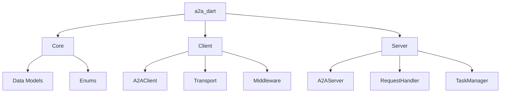

# A2A Dart Library Design Document

## 1. Overview

This document outlines the design for a pure Dart implementation of the Agent2Agent (A2A) protocol. The `a2a_dart` library will provide both client and server components for A2A communication, enabling Dart and Flutter applications to interact with other A2A-compliant agents.

The primary goal is to create a library that is:

- **Comprehensive**: Implements the full A2A specification.
- **Idiomatic**: Feels natural to Dart and Flutter developers.
- **Type-Safe**: Leverages Dart's strong type system to prevent errors.
- **Extensible**: Allows for future expansion and customization.

## 2. Goals and Non-Goals

### Goals

- Provide a type-safe, idiomatic Dart implementation of the A2A protocol.
- Support the full A2A specification, including all data models and RPC methods.
- Offer a clear and easy-to-use client API for interacting with A2A agents.
- Provide a flexible and extensible server framework for building A2A agents in Dart.
- Adhere to Dart and Flutter best practices, including null safety, effective asynchronous programming, and clean architecture.

### Non-Goals

- **Transports**: Implement transport protocols other than JSON-RPC and SSE over HTTP. gRPC and REST transports are out of scope for the initial version.
- **Push Notifications**: The server-side push notification mechanism will not be implemented initially. The client will support sending the configuration, but the server will not act on it.
- **Agent Framework**: Provide a full-fledged agent framework with built-in AI capabilities. This library focuses on the communication protocol.
- **Extensions**: Implement any of the optional extensions to the A2A protocol in the initial version.

## 3. Implemented A2A Features

The `a2a_dart` library will implement the following features from the A2A specification:

### Core Concepts

- **Client & Server**: Foundational components for initiating and responding to A2A requests.
- **Agent Card**: Full implementation for agent discovery and capability advertisement.
- **Task**: State management for all agent operations.
- **Message**: The primary object for communication turns.
- **Part**: Support for `TextPart`, `FilePart`, and `DataPart` to enable rich content exchange.
- **Artifact**: Handling for agent-generated outputs.
- **Context**: Grouping related tasks.

### Transport Protocols

- **JSON-RPC 2.0**: The primary transport protocol for all RPC methods over HTTP/S.
- **Server-Sent Events (SSE)**: For real-time, streaming updates from the server to the client (`message/stream` and `tasks/resubscribe`).

### Data Models

- A complete, type-safe implementation of all data objects defined in the specification, including:
  - `Task`, `TaskStatus`, `TaskState`
  - `Message`, `Part` (and its variants)
  - `AgentCard` (and all nested objects like `AgentSkill`, `AgentProvider`, etc.)
  - `Artifact`
  - `PushNotificationConfig` (client-side only)
  - All JSON-RPC request, response, and error structures.

### RPC Methods

- The library will provide client methods and server-side handlers for the full suite of A2A RPC methods:
  - `message/send`
  - `message/stream`
  - `tasks/get`
  - `tasks/list`
  - `tasks/cancel`
  - `tasks/resubscribe`
  - `tasks/pushNotificationConfig/set`
  - `tasks/pushNotificationConfig/get`
  - `tasks/pushNotificationConfig/list`
  - `tasks/pushNotificationConfig/delete`
  - `agent/getAuthenticatedExtendedCard`

### Authentication

- The library will be designed to work with standard HTTP authentication mechanisms (e.g., Bearer Token, API Key) by providing hooks (middleware) for adding authentication headers to client requests.

## 4. Architecture

The `a2a_dart` library will be structured into three main components:

- **Core**: Contains the data models and types defined in the A2A specification.
- **Client**: Provides the `A2AClient` class and related components for making requests to A2A agents.
- **Server**: Offers a framework for building A2A agents, including request handling and task management.



## 4. Data Models

All data models from the A2A specification will be implemented as immutable Dart classes. To reduce boilerplate and ensure correctness, we will use the `json_serializable` and `freezed` packages for JSON serialization and value equality.

- **Immutability**: All model classes will be immutable.
- **JSON Serialization**: Each class will have `fromJson` and `toJson` methods.
- **Null Safety**: All fields will be null-safe.

Example `AgentCard` model:

```dart
import 'package:freezed_annotation/freezed_annotation.dart';

part 'agent_card.freezed.dart';
part 'agent_card.g.dart';

@freezed
class AgentCard with _$AgentCard {
  const factory AgentCard({
    required String protocolVersion,
    required String name,
    required String description,
    required String url,
    // ... other fields
  }) = _AgentCard;

  factory AgentCard.fromJson(Map<String, dynamic> json) => _$AgentCardFromJson(json);
}
```

## 5. Client API

The client API will be centered around the `A2AClient` class. This class will provide methods for each of the A2A RPC calls, such as `sendMessage`, `getTask`, and `cancelTask`.

- **Asynchronous**: All API methods will be asynchronous, returning `Future`s.
- **Transport Agnostic**: The `A2AClient` will delegate the actual HTTP communication to a `Transport` interface, allowing for different transport implementations (e.g., `HttpTransport` for standard request-response and `SseTransport` for streaming).
- **A2A Handlers**: The client will support a handler pipeline for intercepting and modifying requests and responses. This can be used for logging, authentication, and other cross-cutting concerns.

### 5.1. A2A Handlers

The client will feature an `A2AHandler` pipeline, a powerful mechanism for implementing cross-cutting concerns. Handlers are executed in order for requests and in reverse order for responses, allowing them to wrap the core request/response logic.

This pattern is ideal for:

- **Logging**: Recording request and response data.
- **Authentication**: Injecting authentication tokens into request headers.
- **Caching**: Implementing a caching layer.
- **Error Handling**: Centralizing error handling and reporting.

Example of a logging handler:

```dart
class LoggingHandler implements A2AHandler {
  final Logger _logger = Logger('A2AClient');

  @override
  Future<Map<String, dynamic>> handleRequest(Map<String, dynamic> request) async {
    _logger.info('Request: $request');
    return request;
  }

  @override
  Future<Map<String, dynamic>> handleResponse(Map<String, dynamic> response) async {
    _logger.info('Response: $response');
    return response;
  }
}
```

Example `A2AClient` usage:

```dart
final client = A2AClient(httpTransport: HttpTransport('https://example.com/a2a'), sseTransport: SseTransport('https://example.com/a2a'));

// For a simple request-response
final task = await client.sendMessage(Message(
  role: 'user',
  parts: [TextPart(text: 'Hello, agent!')],
));

// For a streaming response
final stream = client.messageStream(Message(
  role: 'user',
  parts: [TextPart(text: 'Tell me a story.')],
));

await for (final event in stream) {
  // process events
}

print(task.status.state);
```

## 6. Server Framework

The server framework will provide the building blocks for creating A2A-compliant agents in Dart.

- **`A2AServer`**: A top-level class that listens for incoming HTTP requests and routes them to the appropriate `RequestHandler`.
- **`RequestHandler`**: An interface for handling specific A2A methods. Developers will implement this interface to define their agent's behavior.
- **`TaskManager`**: A class responsible for managing the lifecycle of tasks.

## 7. Error Handling

Errors will be handled using a combination of exceptions and a `Result` type. Network and transport-level errors will throw exceptions, while A2A-specific errors will be returned as part of a `Result` object, allowing for more granular error handling.

## 8. Dependencies

- `http`: For making HTTP requests.
- `freezed`: For immutable data classes.
- `json_serializable`: For JSON serialization.
- `logging`: For structured logging.

## 9. Testing

The library will have a comprehensive suite of unit and integration tests.

- **Unit Tests**: Will cover individual classes and methods in isolation.
- **Integration Tests**: Will test the client and server components together, as well as against a known-good A2A implementation.

## 10. Documentation

All public APIs will be thoroughly documented with DartDoc comments. The package will also include a comprehensive `README.md` and example usage.
