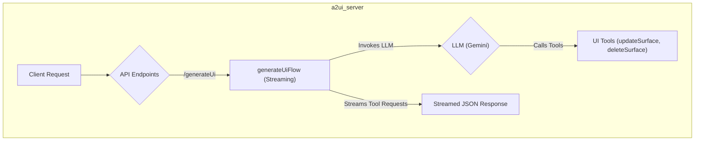
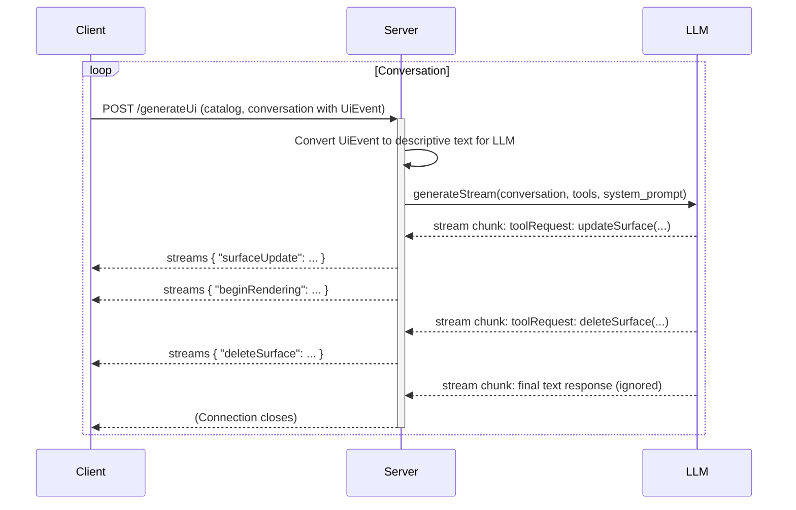

# `a2ui_server` Package Implementation

## Purpose

The `a2ui_server` package is the server-side component of the GenUI framework. Its primary responsibility is to interact with a Large Language Model (LLM) to generate dynamic UI definitions based on a conversation history and a client-provided widget catalog. It is designed to be a stateless, scalable, and secure backend for any GenUI-compatible client.

## Getting Started

To run the server in development mode, use the following command:

```bash
pnpm run genkit:dev
```

This will start the Genkit development server, which provides a web UI for inspecting flows and a local endpoint for the `generateUi` flow.

## Architecture

The server is built using the Genkit framework in TypeScript and managed with the `pnpm` package manager.



### Core Components

1.  **Genkit Framework**: The foundation of the server, providing tools for creating AI flows, managing models, and defining tools. The Genkit configuration is located in `src/genkit.ts`.
2.  **TypeScript**: The language for implementation, providing type safety.
3.  **pnpm**: For efficient and deterministic package management.
4.  **Zod**: For defining the schemas for API inputs and tools.

## Schemas

The `src/schemas.ts` file defines the data structures used for communication between the client and the server. It uses Zod to create robust, validated schemas for:

- The widget catalog (`jsonSchema`).
- The conversation history, including different message parts like text, images, UI events, and UI definitions.
- The main request body for the `generateUi` flow (`generateUiRequestSchema`).

## API Design

The server exposes one primary HTTP endpoint, which corresponds to a Genkit flow defined in `src/generate.ts`.

### `POST /generateUi` (Streaming)

This endpoint generates UI updates in real-time for a given conversation and corresponds to the `generateUiFlow`.

- **Purpose**: To take the current conversation state and generate the next UI to be displayed, streaming tool calls as they are produced by the LLM.
- **Request Body Schema** (`generateUiRequestSchema`):

  ```typescript
  z.object({
    catalog: jsonSchema, // The JSON schema for the client's widget catalog
    conversation: z.array(messageSchema), // The conversation history
  });
  ```

- **Response Body**: A stream of JSON objects representing UI modifications. The server transforms the raw tool calls from the LLM into a specific protocol for the A2UI client. The final text response from the model is ignored.

  - **`surfaceUpdate`**: Sent when a UI surface should be updated with new components.
    ```json
    {
      "surfaceUpdate": {
        "surfaceId": "some-surface",
        "components": [
          { "id": "widget1", "widget": { "type": "text", "text": "Hello" } }
        ]
      }
    }
    ```
  - **`beginRendering`**: Sent after a `surfaceUpdate` to signal that the client should now render the new UI tree.
    ```json
    {
      "beginRendering": {
        "surfaceId": "some-surface",
        "root": "widget1"
      }
    }
    ```
  - **`deleteSurface`**: Sent when a UI surface should be removed.
    ```json
    {
      "deleteSurface": {
        "surfaceId": "some-surface"
      }
    }
    ```

- **Logic**:
  1.  The flow is a **streaming Genkit flow** that uses `ai.generateStream`.
  2.  It dynamically constructs a **system prompt** using the `catalog` from the request. This prompt instructs the LLM on how to structure the UI definition to match the client's capabilities.
  3.  It uses two statically defined Genkit tools: `updateSurface` and `deleteSurface`, both with strict Zod schemas for their inputs.
  4.  It transforms the incoming conversation history into a format suitable for the LLM. Specifically, `uiEvent` parts are converted into a descriptive text block, informing the model about user interactions.
  5.  As the LLM generates content, the flow streams back chunks containing tool requests.
  6.  The flow transforms these tool requests into a specific A2UI protocol for the client:
      - An `updateSurface` tool call is split into two separate streamed messages: `surfaceUpdate` (containing the component definitions) and `beginRendering` (signaling the client to render the new UI tree).
      - A `deleteSurface` tool call is transformed into a single `deleteSurface` message.
  7.  The final text response from the LLM is ignored, as it is not part of the A2UI protocol.
  8.  The client is responsible for interpreting these streamed messages and updating its UI accordingly.

## Data Flow

The following diagram illustrates the sequence of interactions. Note that an `updateSurface` tool call from the LLM results in two separate messages being streamed to the client (`surfaceUpdate` and `beginRendering`), and the final text response from the LLM is ignored.



## Logging

The server uses the `pino` logger for structured logging. By default, logging is disabled. To enable it, set the `LOG_LEVEL` environment variable when running the server.

- **Example (Info Level)**: `LOG_LEVEL=info pnpm run genkit:dev`
- **Example (Debug Level)**: `LOG_LEVEL=debug pnpm run genkit:dev`

Supported log levels are: `fatal`, `error`, `warn`, `info`, `debug`, `trace`. In development, logs are automatically formatted for readability with `pino-pretty`.
