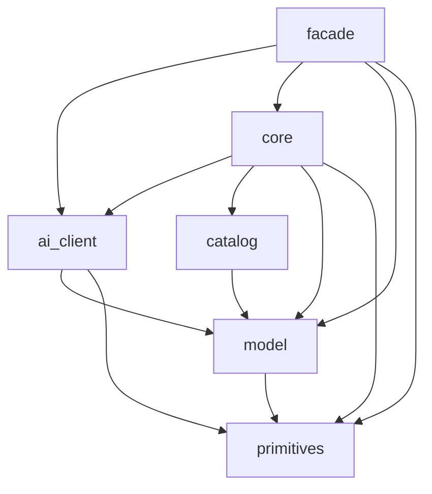

<!---
Generated by https://github.com/polina-c/layerlens
Dependencies that create loops (inversions) are marked with `!`.
-->

```mermaid
flowchart TD;
ai_client-->model;
ai_client-->primitives;
catalog-->model;
core-->ai_client;
core-->catalog;
core-->model;
core-->primitives;
facade-->ai_client;
facade-->core;
facade-->model;
facade-->primitives;
model-->primitives;
```
