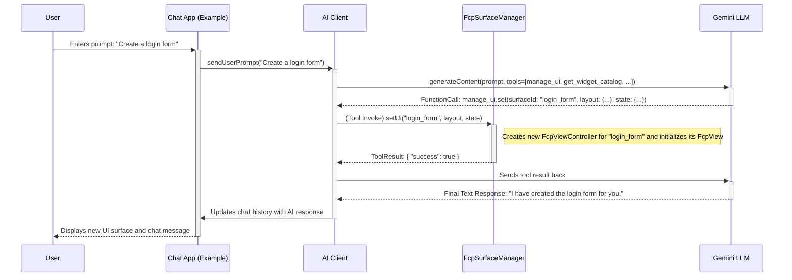

# **Flutter Composition Protocol (FCP) Tools - Product Specification**

This document outlines the product specification for a new Flutter package, `fcp_tools`. This package will provide a set of tools that a Large Language Model (LLM) can use to dynamically create and manipulate a Flutter user interface. It leverages the existing `fcp_client` package for UI rendering.

## **1. Overview**

The `fcp_tools` package enables a new paradigm for human-computer interaction where a user can conversationally build and modify a user interface. By exposing UI manipulation capabilities as a set of well-defined tools to an LLM, we can create applications that are highly dynamic and responsive to user requests.

The core of the package will be:

1. **A Set of AI Tools:** A collection of tool implementations that can be used by an AI client. These tools will provide the LLM with the ability to manage UI "surfaces" and their content.
2. **A Surface Management System:** A central manager in the Flutter application that maintains a collection of active UI surfaces, each controlled by its own `FcpViewController`.
3. **A Chat Application Example:** A complete, working example demonstrating how to integrate the tools, the surface manager, and a chat interface to create a conversational UI generation experience.

## **2. Architecture and Data Flow**

The `fcp_tools` package will integrate several existing components to achieve its goal. The data flow is designed to be unidirectional and predictable, enabling complex UI manipulations from simple conversational prompts.

### **Core Components:**

- **`ai_client` (`AiClient`):** Serves as the primary interface for the application. It manages the conversation history and orchestrates the calls to the Gemini LLM, including passing the tool definitions. The `fcp_tools` package will use this package for its AI-related functionalities.
- **`FcpSurfaceManager` (New):** A new class within `fcp_tools` responsible for managing the lifecycle of multiple UI surfaces. It will maintain a map of `surfaceId` to `FcpViewController` instances. The AI tools will interact with this manager to perform their operations.
- **`fcp_client` (`FcpView`, `FcpViewController`):** The rendering layer. Each surface managed by `FcpSurfaceManager` will be an `FcpView` widget, controlled by its corresponding `FcpViewController`.
- **`dart_schema_builder`:** Used to define the schemas for the tool parameters, ensuring that the LLM provides correctly structured arguments.

## **3. AI Tool Specification**

The package will provide two primary tools, each designed for a specific aspect of UI management.

### **3.1. `manage_ui`**

This tool is the primary mechanism for creating and manipulating UI surfaces. A surface is a distinct, top-level UI area that can be independently created, referenced, and destroyed.

**Actions:**

- **`set(surfaceId: string, layout: Layout, state: State)`**

  - **Description:** Sets the complete UI for a given surface. If the surface with the specified `surfaceId` does not exist, it will be created. This will replace any existing UI on that surface. The `layout` and `state` must conform to the FCP specification.
  - **Parameters:**
    - `surfaceId` (string, required): The ID of the target surface.
    - `layout` (object, required): A valid FCP `Layout` object.
    - `state` (object, required): A valid FCP `State` object.
  - **Returns:** `{ "success": boolean }`

- **`get(surfaceId: string)`**

  - **Description:** Retrieves the current `Layout` and `State` for a given surface.
  - **Parameters:**
    - `surfaceId` (string, required): The ID of the target surface.
  - **Returns:** `{ "layout": Layout, "state": State }`

- **`list()`**

  - **Description:** Lists the IDs of all currently active surfaces.
  - **Parameters:** None.
  - **Returns:** `{ "surfaceIds": string[] }`

- **`remove(surfaceId: string)`**

  - **Description:** Removes/destroys the UI surface with the specified ID.
  - **Parameters:**
    - `surfaceId` (string, required): The ID of the surface to remove.
  - **Returns:** `{ "success": boolean }`

- **`patchLayout(surfaceId: string, operations: LayoutUpdate)`**

  - **Description:** Applies a set of patch operations to the layout of a specific surface.
  - **Parameters:**
    - `surfaceId` (string, required): The ID of the target surface.
    - `operations` (array, required): An array of FCP layout patch operations.
  - **Returns:** `{ "success": boolean }`

- **`patchState(surfaceId: string, patches: StateUpdate)`**
  - **Description:** Applies a set of JSON Patch (RFC 6902) operations to the state of a specific surface.
  - **Parameters:**
    - `surfaceId` (string, required): The ID of the target surface.
    - `patches` (array, required): An array of JSON Patch operations.
  - **Returns:** `{ "success": boolean }`

### **3.2. `get_widget_catalog`**

This tool allows the LLM to query the client's UI capabilities.

**Actions:**

- **`get()`**
  - **Description:** Returns the complete `WidgetCatalog` for the client application. This allows the LLM to know which widgets, properties, and data types are available for it to use when constructing a UI.
  - **Parameters:** None.
  - **Returns:** A `WidgetCatalog` JSON object.

## **4. Example Application**

The package will include a fully functional chat application to demonstrate the usage of the tools.

**Features:**

- A simple, clean chat interface.
- A text input field for users to enter prompts.
- A conversation view that displays both user messages and AI responses.
- A dedicated area where the dynamically generated UI surfaces are rendered.
- The application will initialize an AI client with the tools provided by `fcp_tools` to make them available to the Gemini model.
- The UI will dynamically update as the LLM calls the tools to create and modify surfaces.

This example will serve as a reference implementation and a starting point for developers looking to integrate conversational UI generation into their own applications.
